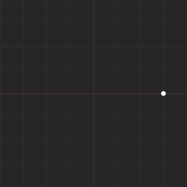
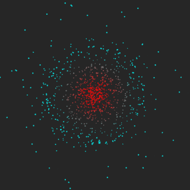

Hienoi
======

.. image:: https://img.shields.io/pypi/v/hienoi.svg
   :target: https://pypi.python.org/pypi/hienoi
   :alt: PyPI latest version

.. image:: https://img.shields.io/pypi/l/hienoi.svg
   :target: https://pypi.python.org/pypi/hienoi
   :alt: License

Hienoi is a framework offering an intuitive visual programming experience based
around simple 2D particle physics.

Features
--------

* 2D particle simulation.
* GUI with OpenGL viewport.
* user-friendly API.
* support for per-particle user attributes.
* fast when directly operating particles through NumPy.
* compatible with both Python 2 and Python 3.

Usage
-----

.. code-block:: python

   >>> import hienoi.application
   >>> from hienoi import Vector2f
   >>> def initialize_particle_simulation(sim):
   ...     sim.add_particle(position=Vector2f(25.0, 0.0))
   >>> def update_particle_simulation(sim):
   ...     particle = sim.particles[0]
   ...     particle.force -= particle.position
   >>> hienoi.application.run(
   ...     particle_simulation={
   ...         'initialize_callback': initialize_particle_simulation,
   ...         'postsolve_callback': update_particle_simulation,
   ...     })

More commented examples can be found in the ``demos`` folder.

Installation
------------

.. code-block:: bash

   $ pip install hienoi

Demos
-----

intro
^^^^^

equilibrium
^^^^^^^^^^^

trail
^^^^^

orbit
^^^^^

Hotkeys
-------

+-----------------------+--------------------------------------------+
|  ``space`` + ``LMB``  |  move view                                 |
+-----------------------+--------------------------------------------+
|  ``space`` + ``RMB``  |  zoom view                                 |
+-----------------------+--------------------------------------------+
|  ``d``                |  change the display mode of the particles  |
+-----------------------+--------------------------------------------+
|  ``f``                |  fit the view to the scene                 |
+-----------------------+--------------------------------------------+
|  ``g``                |  show/hide the grid                        |
+-----------------------+--------------------------------------------+
|  ``r``                |  reset the view                            |
+-----------------------+--------------------------------------------+

Author
------

Christopher Crouzet
<`christophercrouzet.com <https://christophercrouzet.com>`_>
